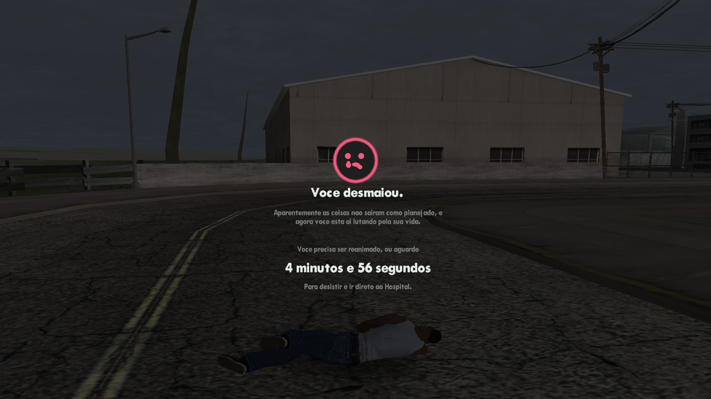
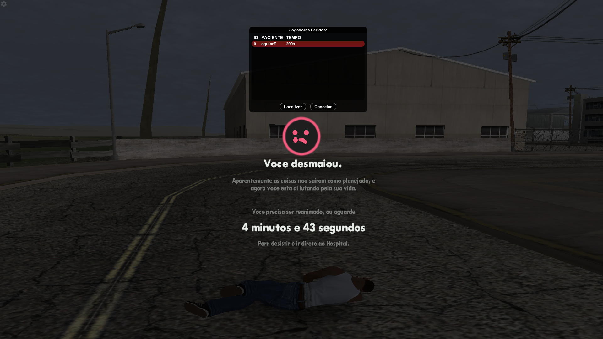

# 🫧 Sistema de Morte – SA-MP

**-** Um sistema básico de **tela de morte** para SA:MP, ideal como base para sistemas de médico e reanimação.

---

## 📜 Comandos

| Comando     | Descrição                                                        |
| ----------- | ---------------------------------------------------------------- |
| `/morrer`   | Faz o jogador se auto-matar e testa o sistema.                   |
| `/feridos`  | Mostra jogadores feridos e permite marcar a localização no mapa. |
| `/reanimar` | Reanima jogadores feridos (base para sistema de médico).         |

---

## ⚙️ Requisitos

* [easyDialog](https://github.com/Awsomedude/easyDialog)

---

## 🛠️ Instalação

1. Baixe o **easyDialog** e adicione ao seu projeto.
2. Adicione os arquivos do **Sistema de Morte** ao seu projeto.
3. Compile e execute o servidor.

---

> [!IMPORTANT]
>
> * O sistema **não possui salvamento de dados**.
> * Desenvolvido utilizando o **easyDialog**.

---

## 👀 Visual do Sistema

